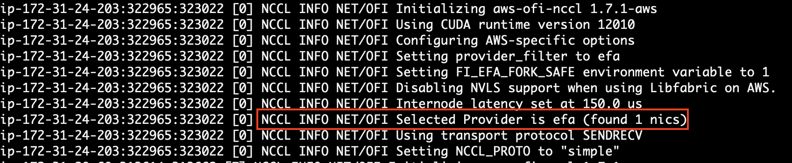
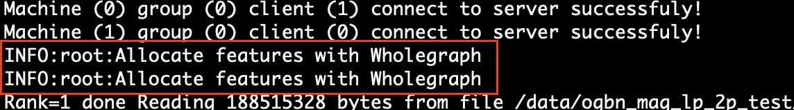

.. _advanced_wholegraph:

Use WholeGraph in GraphStorm
=============================

Motivation
-----------

Feature transfer is often the most expensive module in a link prediction training task . When dealing with MAG-240m datasets, approximately 75% of the epoch time is spent on transferring features from remote machines. To address this critical bottleneck, we have leveraged NVIDIA's `WholeGraph <https://github.com/rapidsai/wholegraph>`_ library. WholeGraph optimizes the procedure by copying node features from remote CPUs to remote GPUs and then efficiently transferring these features to local GPUs. This is achieved through the utilization of the Elastic Fabric Adapter (EFA) network interface and NVIDIA Collective Communications Library (NCCL).  WholeGraph is able to achieve 3.8x speedup in end-to-end training compare to non-WholeGraph counterpart using  P4d instances on Amazon EC2.

GraphStorm now extends WholeGraph support to accelerate learnable embeddings (with WholeGraph sparse optimizer) and language model cached embeddings, broadening the optimization of using WholeGraph and further reducing communication overhead.

.. Note::

    WholeGraph support is an experimental feature of GraphStorm. Currently, only node features can be accessed through WholeGraph. We will add support of accessing edge features through WholeGraph in `the next release <https://github.com/awslabs/graphstorm/issues/512>`_.

Setup GraphStorm-WholeGraph Docker environment
------------------------------------------------

Prerequisite
^^^^^^^^^^^^^^^

    1. **EFA supported Hardware**: Elastic Fabric Adapter (EFA) supported NVIDIA GPU clusters. Amazon EC2 supports EFA on specific instances, including `p3dn.24xlarge`, `p4d.24xlarge`, and `p5.48xlarge`.

    2. **EFA-enabled security group**: Please follow the `steps <https://docs.aws.amazon.com/AWSEC2/latest/UserGuide/efa-start-nccl-base.html#nccl-start-base-setup>`_ to prepare an EFA-enabled security group for Amazon EC2 instances.

    3. **NVIDIA-Docker**: You need to install NVIDIA Docker in your environment and the `Nvidia Container Toolkit <https://docs.nvidia.com/datacenter/cloud-native/container-toolkit/install-guide.html>`_.

For example, in an Amazon EC2 instance without Docker preinstalled, you can run the following commands to install NVIDIA Docker.

.. code:: bash

    distribution=$(. /etc/os-release;echo $ID$VERSION_ID) \
    && curl -fsSL https://nvidia.github.io/libnvidia-container/gpgkey | sudo gpg --dearmor -o /usr/share/keyrings/nvidia-container-toolkit-keyring.gpg \
    && curl -s -L https://nvidia.github.io/libnvidia-container/experimental/$distribution/libnvidia-container.list | \
        sed 's#deb https://#deb [signed-by=/usr/share/keyrings/nvidia-container-toolkit-keyring.gpg] https://#g' | \
        sudo tee /etc/apt/sources.list.d/nvidia-container-toolkit.list
    sudo apt-get update
    sudo apt-get install -y nvidia-docker2
    sudo systemctl daemon-reload
    sudo systemctl restart docker

Launch instance with EFA support
---------------------------------

While launching the EFA supported EC2 instances, in the Network settings section, choose Edit, and then do the following:

    1. For Subnet, choose the subnet in which to launch the instance. If you do not select a subnet, you can't enable the instance for EFA.

    2. For Firewall (security groups), Choose `Select existing security group` and then pick the EFA-enabled security group you previously created as outlined in the prerequisites.

    3. Expand the Advanced network configuration section, and for Elastic Fabric Adapter, select Enable.

Install aws-efa-installer on the EC2 instance
----------------------------------------------

Install aws-efa-installer on both the base instance and within the Docker container. This enables the instance to use AWS's EFA kernel instead of Ubuntu's default kernel. Install the EFA installer without ``--skip-kmod`` on the instance and with ``--skip-kmod`` in the container. A command is provided for the base instance installation, and the Dockerfile will handle container installation in the next step.

.. code:: bash

    curl -O https://efa-installer.amazonaws.com/aws-efa-installer-latest.tar.gz \
    && tar -xf aws-efa-installer-latest.tar.gz \
    && cd aws-efa-installer \
    && apt-get update \
    && apt-get install -y libhwloc-dev \
    && ./efa_installer.sh -y -g -d --skip-limit-conf --no-verify \
    && rm -rf /var/lib/apt/lists/*

Build a GraphStorm-WholeGraph Docker image from source
--------------------------------------------------------

Please use the following command to build a Docker image from source:

.. code:: bash

    git clone https://github.com/awslabs/graphstorm.git
    cd /path-to-graphstorm/docker/
    bash /path-to-graphstorm/docker/build_docker_wholegraph.sh /path-to-graphstorm/ docker-name docker-tag

There are three arguments of the ``build_docker_wholegraph.sh``:

    1. **path-to-graphstorm (required)**, is the absolute path of the ``graphstorm`` folder, where you clone the GraphStorm source code. For example, the path could be ``/code/graphstorm``.

    2. **docker-name (optional)**, is the assigned name of the Docker image to be built. Default is ``graphstorm-wholegraph``.

    3. **docker-tag (optional)**, is the assigned tag of the Docker image to be built. Default is ``local``.

You can use the below command to check if the new Docker image is created successfully.

.. code:: bash

    docker image ls

If the build succeeds, there should be a new Docker image, named `<docker-name>:<docker-tag>`, e.g., ``graphstorm-wholegraph:local``.

Create a GraphStorm-WholeGraph container
-----------------------------------------

You can launch a container based on the Docker image built in the previous step. Make sure to use ``--privileged`` and ``—-network=host`` map your host network to the container:

.. code:: bash

    $ sudo docker run --gpus all \
                      --ipc=host \
                      --ulimit memlock=-1 \
                      --ulimit stack=67108864 \
                      --network=host \
                      --privileged \
                      --name test -d -t graphstorm-wholegraph:local

This command will create a GraphStorm-wholeGraph container, named test and run the container as a daemon.
Then connect to the container by running the following command:

.. code:: bash

    docker container exec -it test /bin/bash

If succeeds, the command prompt will change to the container's, like

.. code:: bash

    root@<ip-address>:/#

.. note::

    If you want to use the built Docker image in a distributed cluster, please make sure you follow the :ref:`Create a GraphStorm Cluster<create_cluster>` step and use the WholeGraph-supported Docker image in your cluster.

Verify EFA and NCCL configuration
-----------------------------------

The docker file installs the required software such as EFA software and NCCL library to enable WholeGraph in GraphStorm. Ensure to thoroughly test your EFA configurations on your instances, as improper configuration may automatically revert to default providers without displaying any error messages.

Confirm that the EFA software components were successfully installed.

.. code:: bash

    fi_info -p efa -t FI_EP_RDM

The command should return information about the Libfabric EFA interfaces. The following example shows the command output in a g4dn.metal instance with single EFA network interface:

.. code:: bash

    fi_info -p efa -t FI_EP_RDM
    provider: efa
    fabric: efa
    domain: efa_0-rdm
    version: 118.20
    type: FI_EP_RDM
    protocol: FI_PROTO_EFA

Instances such as `p4d.24xlarge` and `p5.48xlarge` with multiple network interfaces should display information about multiple interfaces.

After successfully installing EFA on all the instances, next, verify network communication with ``mpirun`` while enabling the ``NCCL_DEBUG`` option with the following command:

.. code:: bash

    mpirun -x NCCL_DEBUG=INFO \
    --allow-run-as-root \
    -n <Sum of num_gpus on all instances> \
    -H <ip1>:<num_gpus of instance1>,<ip2>:<num_gpus of instance2>, <ip3>...
    --bind-to none  alltoall_perf_mpi \
    -duint8 -b8 -e2G -f2 -g1 |& tee

The `<ip>` should hold the IP address of the docker container .

The output should resemble with the following screenshot which includes `NCCL INFO NET/OFI Selected Provider is efa`:

Convert node features to a WholeGraph-compatible format
---------------------------------------------------------

Different from typical GraphStorm training where node features are stored in the ``node_feat.dgl`` in each partition, to utilize WholeGraph, the node features must be converted into a compatible WholeGraph format. After construct your raw data into GraphStorm required DistDGL format following this :ref:`graph construction tutorial<use-own-data>`, users can achieve this by utilizing the `convert_feat_to_wholegraph.py <https://github.com/awslabs/graphstorm/blob/main/tools/convert_feat_to_wholegraph.py>`_ script with ``--dataset-path`` pointing to the folder with the partitioned graph data and specify the features to be transformed using the ``--node-feat-names`` option. For example:

.. code:: bash

    python3 convert_feat_to_wholegraph.py \
            --dataset-path ogbn-mag240m-2p \
            --node-feat-names paper:feat

You can provide multiple features names such as ``--feat-names paper:feat author:feat1,feat2 institution:feat``.

In the above example, the script will create a new folder named ``wholegraph`` under the ``ogbn-mag240m-2p`` folder, containing the WholeGraph input files. And the script will trim the distDGL file ``node_feat.dgl`` in each partition to remove the specified feature attributes, leaving only other attributes such as ``train_mask``, ``test_mask``, ``val_mask`` or ``labels`` intact. The script also keeps an copy of the original file in ``node_feat.dgl.bak``.

Run training jobs for link prediction using WholeGraph
-------------------------------------------------------

After completing the setup steps outlined in 1-3, launching a GraphStorm task with WholeGraph becomes a straightforward process. Once the machines are configured correctly, training jobs can be initiated using regular GraphStorm scripts. Utilizing WholeGraph within GraphStorm for feature transfer is seamless and doesn't require any additional steps. The system automatically detects the generated ``wholegraph`` folder and utilizes WholeGraph when available.

GraphStorm also supports using WholeGraph to accelerate learnable embeddings (with WholeGraph sparse optimizer) and language model cached embeddings. To take advantage of this optimization, one can simply add the `--use-wholegraph-embed` argument to your command line.

For example link prediction task can be initiated using the following command:

.. code:: bash

    python3 -m graphstorm.run.gs_link_prediction \
            --workspace /data/ogbn_mag_lp/ \
            --num-trainers 4 \
            --num-servers 1 \
            --num-samplers 0 \
            --part-config /data/ogbn_mag_lp_2p/ogbn-mag.json \
            --ip-config /data/ip_list.txt \
            --ssh-port 2222 \
            --graph-format csc,coo \
            --cf /graphstorm/training_scripts/gsgnn_lp/mag_lp.yaml \
            --node-feat-name paper:feat \
            --use-wholegraph-embed true

The output should include the following messages confirming the use of WholeGraph.

