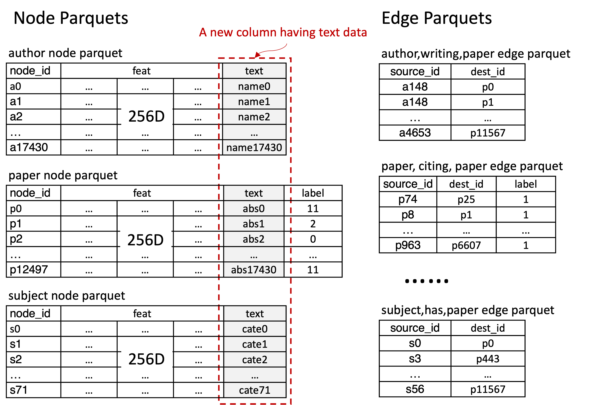

.. _language_models:

Use Language Models in GraphStorm
==================================
Many real world graphs have text contents as nodes' features, e.g., the title and description of a product, and the questions and comments from users. To leverage these text contents, GraphStorm supports multiple language models (LMs) from HuggingFace to embed text contents and use these embeddings for various Graph Machine Learning tasks.

There are a set of modes to use LMs in GraphStorm.

#. Use Pre-trained LMs only without fine-tuning
    In this mode, users can embed text contents with pre-trained LMs, and then use them as the input node features to train GNN models, but do not fine-tune the LMs. Model training speed in this mode is fast, and memory consumption will be lower. However, in some cases, pre-trained LMs may not fit to the text data on graph well, hence not improving performance.

#. Fine-tune LMs on graph data
    To achieve better performance, it is better to fine-tune LMs with graph data. To achieve this goal, GraphStorm provides four training strategies.

    * Fine-tune LMs only

    In this mode, users can fine-tune LMs relying on labels at graph data, e.g. labels of node/edge or positive/negative edges for link prediction. In this mode, there is no GNN models involved, which means the final performance depends on nodes' features (including text features) only without using graph information. Using this mode may not achieve the best performance, but could pave the way of other modes, e.g. two-step co-training.

    * Two-step co-training manually

    In this mode, users can train both LMs and GNNs in two steps. The first step is similar as the Fine-tune LMs only mode, and the fine-tuned LMs are saved. In the second step, GraphStorm loads the saved LMs, computes embeddings on text features, and then use them as inputs to train GNN models. In this mode, users have the options to fine-tune LMs on the GML tasks different from GNN models. For example, the fine-tuning could be done on a link prediction task, and the trained LMs then could be used by GNN models for node classification tasks.

    * Auto two-step co-training (GLEM)

    GraphStorm currently provdies an experimental feature based on `GLEM <https://arxiv.org/abs/2210.14709>`_, which trains LM and GNN models iteratively for node classification. In this mode, GLEM automatically conducts the two step co-training iteratively. Under certain prerequsites, this mode can achieve good performance on node classification.

    * Co-train LMs and GNN

    In this mode, LMs and GML models are co-train in the same training epoch simultaneousely, which will better fit the LMs and GNN models to graph data. However, co-train LMs and GNN models will consume much more memory, particularly GPU memory, and take much longer time to complete training loops.

This tutorial will help users to learn how to use GraphStorm for all of the above modes. Given that using language models on text could take longer time than general GNN only training, this tutorial uses a relatively small demo graph for a quick-start. Users can refer the `GraphStorm MAG example <https://github.com/awslabs/graphstorm/tree/main/examples/mag>`_ for an large textual graph example.

.. warning::

    - All commands below are designed to run in a GraphStorm Docker container. Please refer to the :ref:`GraphStorm Docker environment setup<setup>` to prepare the Docker container environment.

    - If you set up the :ref:`GraphStorm environment with pip Packages<setup_pip>`, please replace all occurrences of "2222" in the argument ``--ssh-port`` with **22**, and clone GraphStorm toolkits. And if use this method to setup GraphStorm environment, you may need to replace the ``python3`` command with ``python``, depending on your Python versions.

Prepare Text Graph Data
------------------------

Create Raw ACM Graph Tables
~~~~~~~~~~~~~~~~~~~~~~~~~~~~~~

This tutorial will use the same ACM data as the :ref:`Use Your Own Data<use-own-data>` tutorial but add text data as node features.

First go the ``/graphstorm/examples/`` folder.

.. code-block:: bash

    cd /graphstorm/examples 

Then run the command to create the ACM data with the required ``raw_w_text`` format by specifying the ``--output-type`` argument.

.. code-block:: bash
    
    python3 /graphstorm/examples/acm_data.py --output-path /tmp/acm_raw --output-type raw_w_text

Once successful, the command will create a set of folders and files under the ``/tmp/acm_raw/`` folder. Format and contents of these files are similar to the :ref:`outputs<acm-raw-data-output>` in the :ref:`Use Your Own Data<use-own-data>` tutorial except that there is one new column, called "text", in node data files that contains text data as demonstrated in the figure below. For each ``paper`` node, the text data is the paper's title and abstract; for each ``author`` node, the text data is the author's full name; and for each ``subject``, the text data is the subject's ACM category code.



In addition, the contents of the ``config.json`` file have a few extra lines that list the text feature columns and specify how they should be processed during graph contruction. 

The following snippet shows the information of ``author`` nodes. It indicates that the "**text**" column contains text features, and it require the GraphStorm's graph contruction tool to use a `HuggingFace BERT model <https://huggingface.co/models>`_ named ``bert-base-uncased`` to tokenize these text features during construction.

.. code-block:: json

    "nodes": [
        {
            "node_type": "author",
            "format": {
                "name": "parquet"
            },
            "files": [
                "/tmp/acm_raw/nodes/author.parquet"
            ],
            "node_id_col": "node_id",
            "features": [
                {
                    "feature_col": "feat",
                    "feature_name": "feat"
                },
                {
                    "feature_col": "text",
                    "feature_name": "text",
                    "transform": {
                        "name": "tokenize_hf",
                        "bert_model": "bert-base-uncased",
                        "max_seq_length": 16
                    }
                }
            ]
        }

Construct Graph
~~~~~~~~~~~~~~~~~

Then we use the graph construction tool to process this ACM raw data with the following command.

.. code-block:: bash

    python3 -m graphstorm.gconstruct.construct_graph \
               --conf-file /tmp/acm_raw/config.json \
               --output-dir /tmp/acm_nc \
               --num-parts 1 \
               --graph-name acm

Outcomes of this command are also same as the :ref:`Outputs of Graph Construction<output-graph-construction>`. But users may notice that the ``paper``, ``author``, and ``subject`` nodes all have three additional features, named ``input_ids``,``attention_mask``, and ``token_type_ids``, which are generated by the BERT tokenizer.

Using Language Model in GraphStorm
-----------------------------------------
With the ACM text graph ready, users can explore the aforementioned modes to use LMs in GraphStorm by just adding or changing related configurations without any coding.

.. Note:: To run the commands in this section, we assume an `ip_list.txt` file has been created in the ``/tmp/`` folder. Users can use the following commands to create this file.

    .. code-block:: bash

        touch /tmp/ip_list.txt
        echo 127.0.0.1 > /tmp/ip_list.txt

1. Use Pre-trained LMs only
~~~~~~~~~~~~~~~~~~~~~~~~~~~~

GraphStorm configurations
```````````````````````````
To use pre-trained LMs, users juset need to set up ``node_lm_models`` arguments in GraphStorm's configuration YAML file. Below is an example of such configuration for the ACM data. The full configuration YAML file, `acm_lm_nc.yaml <https://github.com/awslabs/graphstorm/blob/main/examples/use_your_own_data/acm_lm_nc.yaml>`_, is located under GraphStorm's ``examples/use_your_own_data`` folder.

.. code-block:: yaml

  lm_model:
  node_lm_models:
    -
      lm_type: bert
      model_name: "bert-base-uncased"
      gradient_checkpoint: true
      node_types:
        - paper
        - author
        - subject

The current version of GraphStorm supports several types of pre-trained LM models from HuggingFace reposity on nodes only. Users can choose any `HuggingFace LM models <https://huggingface.co/models>`_ listed in the following: ``lm_type``: ``"bert", "roberta", "albert", "camembert", "ernie", "ibert", "luke", "mega", "mpnet", "nezha", "qdqbert","roc_bert"``. But the value of ``model_name`` **MUST** be the same as the one specified in the raw data JSON file's ``bert_model`` field. Here in the example, it is the ``bert-base-uncased`` model.

The ``node_type`` field lists the types of nodes that have tokenized text features. In this ACM example, all three types of nodes have tokenized text features, so we list them all in the configuration YAML file.

As the pre-trained LM is only used to embed the text feature, we need a GNN model to perform the node classification task. In the ``acm_lm_nc.yaml``, we choose ``rgcn`` for the model encoder.

.. code-block:: yaml

  gsf:
    basic:
      model_encoder_type: rgcn


The launch command
`````````````````````
The following command uses the ``acm_lm_nc.yaml`` file train an RGCN GNN model with pre-trained Bert embeddings.

.. code-block:: bash

    python3 -m graphstorm.run.gs_node_classification \
            --workspace /tmp \
            --part-config /tmp/acm_nc/acm.json \
            --ip-config /tmp/ip_list.txt \
            --num-trainers 4 \
            --num-servers 1 \
            --num-samplers 0 \
            --ssh-port 2222 \
            --cf /graphstorm/examples/use_your_own_data/acm_lm_nc.yaml \
            --save-model-path /tmp/acm_nc/models

In the training process, GraphStorm will first use the specified BERT model to compute the text embeddings in the specified node types. And then the text embeddings and other node features, if have, are concatenated together as the input node feature for GNN models training.

To simplify model tunning, users can also set GraphStorm configurations in the command line directly. For example, the following command modify the ``model_encoder_type`` value to be ``rgat``.

.. code-block:: bash

    python3 -m graphstorm.run.gs_node_classification \
            --workspace /tmp \
            --part-config /tmp/acm_nc/acm.json \
            --ip-config /tmp/ip_list.txt \
            --num-trainers 4 \
            --num-servers 1 \
            --num-samplers 0 \
            --ssh-port 2222 \
            --cf /graphstorm/examples/use_your_own_data/acm_lm_nc.yaml \
            --save-model-path /tmp/acm_nc/models \
            --model-encoder-type rgat \
            --num-heads 8

Users can also try ``hgt`` as the model encoder.

Model performance
```````````````````

.. Note::
    
    * Performance numbers reported in this tutorial, including running time and accuracy for classification, are collected in one AWS g4dn.12xlarge instance that has 48vCPUs, 192GB memory, and four T4 GPUs each of which has 16GB GPU memory. These numbers might vary depending on the computers users use.

    * Commands used in this tutorial set the ``--num-trainers`` to be ``4`` to fully leverage the 4 GPUs in the AWS g4dn.12xlarge instance. Users need to adjust this number to fit their own computers, e.g., set to ``1`` if there is only 1 GPU in their computers.

    * For most of experiments in this tutorial, it might take more than 200 epochs to achieve the best accuracy.

**Run time:**

* LM embedding computation: 4s (one time job) 
* training: 1.4s per epoch;
* validation: 0.4s per epoch;
* model saving: 0.6s each time.

**Best accuracy on validation set:**

* RGCN: ~0.61
* RGAT: ~0.62
* HGT: ~0.58

2. Fine-tune LMs on graph data
~~~~~~~~~~~~~~~~~~~~~~~~~~~~~~~

.. _21ft_lm_only:

2.1 Fine-tune LMs only
````````````````````````

GraphStorm configurations
############################

To fine-tune LMs without using GNN models, users just need to set the ``model_encoder_type`` to be ``lm``  and provide a number for the ``lm_train_nodes`` like in the following snippet. This will disable GNN models during trainin, i.e., the overall model architecure is an LM plus an MLP. 

.. code-block:: yaml

  ...
    model_encoder_type: lm
    lm_train_nodes: 256

The launch command
#####################

The following command uses the ``acm_lm_ft_nc.yaml`` file to fine-tune the LM only.

.. code-block:: bash

    python3 -m graphstorm.run.gs_node_classification \
            --workspace /tmp \
            --part-config /tmp/acm_nc/acm.json \
            --ip-config /tmp/ip_list.txt \
            --num-trainers 4 \
            --num-servers 1 \
            --num-samplers 0 \
            --ssh-port 2222 \
            --cf /graphstorm/examples/use_your_own_data/acm_lm_ft_nc.yaml \
            --save-model-path /tmp/acm_nc/models

The ``lm_train_nodes`` argument determines how many nodes will be used in each mini-batch per GPU to tune the BERT models. Because the BERT models are normally large, training of them will consume many memories. If use all nodes to co-train BERT and GNN models, it could cause GPU out of memory (OOM) errors. Use a relative small number for the ``lm_train_nodes`` could reduce the overall GPU memory consumption.

Model performance
#####################

**Run time:**

* training: 4s per epoch;
* LM embedding computation: 7s
* validation: 7s per epoch;
* model saving: 3s each time.

**Best accuracy on validation set:**

* LM: ~0.55

.. _22two_step_mannually:

2.2 Two-step co-training manually
``````````````````````````````````

GraphStorm configurations
############################
In the two-step co-training, users not only can fine tune LMs with the same GML task, e.g., node classification in the :ref:`_21ft_lm_only` section, but also can fine tune LMs with different tasks, such as link prediction.

To fine tune LMs for link prediction, users can refer to the ``acm_lm_ft_lp.yaml``, which includes the following link prediction related configurations.

.. code-block:: yaml

    link_prediction:
      num_negative_edges: 4
      num_negative_edges_eval: 100
      train_negative_sampler: joint
      eval_etype:
        - "paper,citing,paper"
        - "author,writing,paper"
      train_etype:
        - "paper,citing,paper"
        - "author,writing,paper"
      exclude_training_targets: false
      reverse_edge_types_map: []

Once LMs are fine-tuned, users can perform GNN model training with the saved LMs by setting the ``restore_model_path`` configuration to where the best fine-tuned LMs are stored, and setting the ``restore_model_layers`` to be ``dense_embed``, which is the layer containing text embeddings. To train the GNN models, users can reuse the ``acm_lm_nc.yaml`` configuration file, but just add the above two configurations as launch command arguments.

The launch command
#####################

The following command use the ``acm_lm_ft_lp.yaml`` file to fine-tune the LM on a link predicton task by using these ``paper,citing,paper`` and ``author,writing,paper`` edges as labels.

.. code-block:: bash

    python3 -m graphstorm.run.gs_link_prediction \
            --workspace /tmp \
            --part-config /tmp/acm_nc/acm.json \
            --ip-config /tmp/ip_list.txt \
            --num-trainers 4 \
            --num-servers 1 \
            --num-samplers 0 \
            --ssh-port 2222 \
            --cf /graphstorm/examples/use_your_own_data/acm_lm_ft_lp.yaml \
            --save-model-path /tmp/acm_nc/models

Then users can use the command below to train an RGCN model based on the saved fine-tuned LMs. Because the saved model folder varied from fine-tuning to fine-tuning, here the command uses the ``--restore-model-path`` argument to provide this value, instead of defining it in the ``acm_lm_nc.yaml`` file. For the fine-tuning on link prediction task, users can choose one epoch that has the lowest training loss value as the best fine-tuned checkpoint.

.. code-block:: bash

    python3 -m graphstorm.run.gs_node_classification \
            --workspace /tmp \
            --part-config /tmp/acm_nc/acm.json \
            --ip-config /tmp/ip_list.txt \
            --num-trainers 4 \
            --num-servers 1 \
            --num-samplers 0 \
            --ssh-port 2222 \
            --cf /graphstorm/examples/use_your_own_data/acm_lm_nc.yaml \
            --save-model-path /tmp/acm_nc/models \
            --restore-model-path /tmp/acm_nc/models/epoch-145 \
            --restore-model-layers dense_embed

Users can add the ``--model-encoder-type`` argument to change the GNN models, e.g., ``rgat`` and ``hgt``.

Model performance
#####################

**Run time:**

* Link prediction fine-tuning training: 51s per epoch
* Link prediction fine-tuned model saving: 1s each time

* GNN training: 2s per epoch
* GNN validation: 0.5s per epoch
* GNN model saving: 2~3s each time

**Best accuracy on validation set:**

* RGCN: ~0.64
* RGAT: ~0.65
* HGT: ~0.63

All above best accuracy values were achieved using LP fine-tuning.

2.3 Auto two-step co-training (GLEM)
`````````````````````````````````````

There are two important pre-requisites for achieving good performance when using GLEM strategy.

1. Well pre-trained LM and GNN before the GLEM co-training: empirically, LM or GNN models that are not well-trained lead to degraded performance when co-training with GLEM directly. Therefore, users need to pre-train the LMs and GNN Models first.

To pre-train LMs and GNN models, users can follow the :ref:`22two_step_mannually` instruction and save the best LMs and GNN models.

2. The pseudolabeling technique: this technique predicts pseudolabels on the unlabeled nodes and uses them as additional supervision signals for mutual distillation between LM and GNN. This can be enabled by the setting the ``use_pseudolabel`` argument.

GraphStorm configurations
##########################

To use GLEM, users need to set a new configuration, called ``training_method``, which specifies how to utilize specific model training method. Users can refer to the ``acm_glem_nc_pretrain.yaml`` that includes the following ``training_method`` related configurations.

.. code-block:: yaml

    training_method:
      name: glem
      kwargs:
        em_order_gnn_first: false
        inference_using_gnn: true
        pl_weight: 0.5
        num_pretrain_epochs: 100
    use_pseudolabel: true

Within the ``traing_method`` section, there are two important configurations. First, the ``pl_weight`` defines the weights of pseudolabel, which determines the importance of pseudolabel in mutual distillation. Users can lower the value to reduce the influence of using pseudolabel. The second important configuration is the ``num_pretrain_epochs``. The GLEM method provides its own pre-training implementation, which train LMs and GNN models iteratively in one epoch, i.e., first fix GNN model and train LMs in one forward and backward loop, and then fix LM but use it to embed text as input for GNN models to be trained in one loop. In the pre-training epochs, GLEM will not use the pseudolabel, but the true labels only, even if users set the ``use_pseudolabel`` configuration to be true.

The launch command
######################

The following command uses the ``acm_glem_nc_pretrain.yaml`` file to pre-train LMs and GNN models for using GLEM in the first 100 epochs.

.. code-block:: bash

    python3 -m graphstorm.run.gs_node_classification \
            --workspace /tmp \
            --part-config /tmp/acm_nc/acm.json \
            --ip-config /tmp/ip_list.txt \
            --num-trainers 4 \
            --num-servers 1 \
            --num-samplers 0 \
            --ssh-port 22 \
            --cf /graphstorm/examples/use_your_own_data/acm_glem_nc_pretrain.yaml \
            --save-model-path /tmp/acm_nc/pretrain_models/

Once pre-training finished, users can specify the saved models and the LM layers to perform GLEM co-training with the ``acm_glem_nc.yaml``.

.. code-block:: bash

    python3 -m graphstorm.run.gs_node_classification \
            --workspace /tmp \
            --part-config /tmp/acm_nc/acm.json \
            --ip-config /tmp/ip_list.txt \
            --num-trainers 4 \
            --num-servers 1 \
            --num-samplers 0 \
            --ssh-port 2222 \
            --cf /graphstorm/examples/use_your_own_data/acm_glem_nc.yaml \
            --use-pseudolabel true \
            --restore-model-path /tmp/acm_nc/pretrain_models/epoch-75/ \
            --restore-model-layers embed

.. note:: 

    The GLEM pre-training implementation will create a **LM**, and a **GNN** subfolder under the ``--save-model-path`` plus epoch number. However, if users pre-train LMs and GNN models with other methods, they will need to copy or move these saved LMs into a **LM** subfolder, and GNN models into a **GNN** subfolder both under the same folder to be specified in the ``--restore-model-pat`` argument.

Model performance
###################

**Run time:**

* GLEM LM training: 5s per epoch
* GLEM LM validation: 5s per epoch
* GLEM GNN training: 37s per epoch
* GLEM GNN validation: 6s per epoch
* LM model saving: 9s each time
* GNN model saving: 1s each time

**Best accuracy on validation set:**

* RGCN: ~0.61
* RGAT: ~0.62
* HGT: ~0.61

2.4 Co-train LMs and GNN models
`````````````````````````````````

GraphStorm configurations
##########################

To co-train LMs and GNN models, users only  need to set the ``model_encoder_type`` to be one of the built-in GNN models, and also give a number to ``lm_train_nodes``. Therefore here users can reuse the ``acm_lm_nc.yaml`` file and add the ``--lm-train-nodes`` argument in command line.

The launch command
######################

.. code-block:: bash

    python3 -m graphstorm.run.gs_node_classification \
            --workspace /tmp \
            --part-config /tmp/acm_nc/acm.json \
            --ip-config /tmp/ip_list.txt \
            --num-trainers 4 \
            --num-servers 1 \
            --num-samplers 0 \
            --ssh-port 2222 \
            --cf /graphstorm/examples/use_your_own_data/acm_lm_nc.yaml \
            --save-model-path /tmp/acm_nc/models \
            --lm-train-nodes 256

Model performance
###################

**Run time:**

* trainging: 45s per epoch
* validation: 7s per epoch
* model saving: 1s each time

**Best accuracy on validation set:**

* RGCN: ~0.64
* RGAT: ~0.62
* HGT: ~0.64

