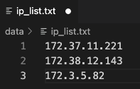

===============================================
Running partition jobs on Amazon EC2 Clusters
===============================================

Once the :ref:`distributed processing<gsprocessing_distributed_setup>` is completed,
users can start the partition jobs. This tutorial will provide instructions on how to setup an EC2 cluster and
start GSPartition jobs on it.

Create a GraphStorm Cluster
----------------------------

Setup instances of a cluster
.............................
A cluster contains several instances, each of which runs a GraphStorm Docker container. Before creating a cluster, we recommend to
follow the :ref:`Environment Setup <setup_docker>`. The guide shows how to build GraphStorm Docker images, and use a Docker container registry,
e.g. `AWS ECR <https://docs.aws.amazon.com/ecr/>`_ , to upload the GraphStorm image to an ECR repository, pull it on the instances in the cluster,
and finally start the image as a container.

.. note::

    If you are planning to use **parmetis** algorithm, please prepare your docker image using the following instructions:

    .. code-block:: bash

        git clone https://github.com/awslabs/graphstorm.git

        cd /path-to-graphstorm/docker/

        bash /path-to-graphstorm/docker/build_docker_parmetis.sh /path-to-graphstorm/ image-name image-tag

    There are three positional arguments for ``build_docker_parmetis.sh``:

    1. **path-to-graphstorm** (**required**), is the absolute path of the "graphstorm" folder, where you cloned the GraphStorm source code. For example, the path could be ``/code/graphstorm``.
    2. **image-name** (optional), is the assigned name of the Docker image to be built . Default is ``graphstorm``.
    3. **image-tag** (optional), is the assigned tag prefix of the Docker image. Default is ``local``.

Setup a shared file system for the cluster
...........................................
A cluster requires a shared file system, such as NFS or `EFS <https://docs.aws.amazon.com/efs/>`_, mounted to each instance in the cluster, in which all GraphStorm containers can share data files, save model artifacts and prediction results.

`Here <https://github.com/dmlc/dgl/tree/master/examples/pytorch/graphsage/dist#step-0-setup-a-distributed-file-system>`_ is the instruction of setting up an NFS for a cluster. As the steps of setting an NFS could be various on different systems, we suggest users to look for additional information about NFS setting. Here are some available resources: `NFS tutorial <https://www.digitalocean.com/community/tutorials/how-to-set-up-an-nfs-mount-on-ubuntu-22-04>`_ by DigitalOcean, `NFS document <https://ubuntu.com/server/docs/service-nfs>`_ for Ubuntu.

For an AWS EC2 cluster, users can also use EFS as the shared file system. Please follow 1) `the instruction of creating EFS <https://docs.aws.amazon.com/efs/latest/ug/gs-step-two-create-efs-resources.html>`_; 2) `the instruction of installing an EFS client <https://docs.aws.amazon.com/efs/latest/ug/installing-amazon-efs-utils.html>`_; and 3) `the instructions of mounting the EFS filesystem <https://docs.aws.amazon.com/efs/latest/ug/efs-mount-helper.html>`_ to set up EFS.

After setting up a shared file system, we can keep all graph data in a shared folder. Then mount the data folder to the ``/path_to_data/`` of each instances in the cluster so that all GraphStorm containers can access the data.

Run a GraphStorm container
...........................
In each instance, use the following command to start a GraphStorm Docker container and run it as a backend daemon on cpu.

.. code-block:: shell

    docker run -v /path_to_data/:/data \
                      -v /dev/shm:/dev/shm \
                      --network=host \
                      -d --name test graphstorm:local-cpu service ssh restart

This command mounts the shared ``/path_to_data/`` folder to a container's ``/data/`` folder by which GraphStorm codes can access graph data and save the partition result.

Setup the IP Address File and Check Port Status
----------------------------------------------------------

Collect the IP address list
...........................
The GraphStorm Docker containers use SSH on port ``2222`` to communicate with each other. Users need to collect all IP addresses of all the instances and put them into a text file, e.g., ``/data/ip_list.txt``, which is like:

.. note:: We recommend to use **private IP addresses** on AWS EC2 cluster to avoid any possible port constraints.

Put the IP list file into container's ``/data/`` folder.

Check port
................
The GraphStorm Docker container uses port ``2222`` to **ssh** to containers running on other machines without password. Please make sure the port is not used by other processes.

Users also need to make sure the port ``2222`` is open for **ssh** commands.

Pick one instance and run the following command to connect to the GraphStorm Docker container.

.. code-block:: bash

    docker container exec -it test /bin/bash

Users need to exchange the ssh key from each of GraphStorm Docker container to
the rest containers in the cluster: copy the keys from the ``/root/.ssh/id_rsa.pub`` from one container to ``/root/.ssh/authorized_keys`` in containers on all other containers.
In the container environment, users can check the connectivity with the command ``ssh <ip-in-the-cluster> -o StrictHostKeyChecking=no -p 2222``. Please replace the ``<ip-in-the-cluster>`` with the real IP address from the ``ip_list.txt`` file above, e.g.,

.. code-block:: bash

    ssh 172.38.12.143 -o StrictHostKeyChecking=no -p 2222

If successful, you should login to the container with ip 172.38.12.143.

If not, please make sure there is no restriction of exposing port 2222.

Launch GSPartition Jobs
-----------------------

Now we can ssh into the **leader node** of the EC2 cluster, and start GSPartition process with the following command:

.. code:: bash

    python3 -m graphstorm.gpartition.dist_partition_graph
        --input-path ${LOCAL_INPUT_DATAPATH} \
        --metadata-filename ${METADATA_FILE} \
        --output-path ${LOCAL_OUTPUT_DATAPATH} \
        --num-parts ${NUM_PARTITIONS} \
        --partition-algorithm ${ALGORITHM} \
        --ip-config ${IP_CONFIG}

.. warning::
    1. Please make sure the both ``LOCAL_INPUT_DATAPATH`` and ``LOCAL_OUTPUT_DATAPATH`` are located on the shared filesystem.
    2. The number of instances in the cluster should be equal to ``NUM_PARTITIONS``.
    3. For users who only want to generate partition assignments instead of the partitioned DGL graph, please add ``--partition-assignment-only`` flag.

Currently we support both ``random`` and ``parmetis`` as the partitioning algorithm for EC2 clusters.
