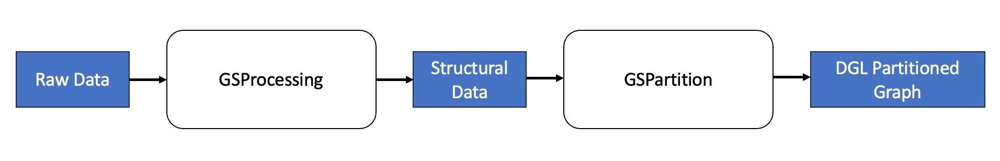

.. _distributed-gconstruction:

Distributed Graph Construction
==============================

Beyond single machine graph construction, distributed graph construction offers enhanced scalability
and efficiency. This process involves two main steps: GraphStorm Distributed Data Processing (GSProcessing)
and GraphStorm Distributed Graph Partitioning (GSPartition).The below diagram is an overview of the workflow for distributed graph construction.

* **GSProcessing**: It accepts tabular files in parquet/CSV format, and prepares the raw data into structured data for partitioning, including edge and node data, transformation details, and node id mappings.
* **GSPartition**: It will process these structured data to create multiple partitions in `DGL Distributed Graph <https://docs.dgl.ai/en/latest/api/python/dgl.distributed.html#distributed-graph>`_ format for distributed model training and inference. 

The following sections provide guidance on doing GSProcessing and GSPartition. In addition, this tutorial also offers an example that demonstrates the end-to-end distributed graph construction process.

.. toctree::
   :maxdepth: 1
   :glob:

   gsprocessing/index.rst
   gspartition/index.rst
   example.rst