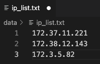

.. _distributed-cluster:

Model Training and Inference on a Distributed Cluster
======================================================
GraphStorm can scale to the enterprise-level graphs in the distributed mode by using a cluster of instances. To leverage this capacity, there are four steps to follow:

* Create a cluster with instances each of which can run GraphStorm Docker container.
* Set up the IP address file and check port 2222 status.
* Partition large graphs into distributed format.
* Launch the training command within one instance' container.

The first section of this tutorial uses the `OGB-MAG <https://ogb.stanford.edu/docs/nodeprop/#ogbn-mag>`_ as an example data to demonstrate how to use GraphStorm to train an RGCN model (a built-in model) in a cluster with three EC2 instances. The OGB-MAG data is large enough to demonstrate the scalability of GraphStorm, and also small enough to complete training in short time.

.. _create_cluster:

Create a GraphStorm Cluster
----------------------------

Setup the instance of a cluster
.......................................
A cluster contains several instances each of which can run GraphStorm Docker container.

To create such a cluster, in one instance, please follow the :ref:`Environment Setup <setup_docker>` description to setup GraphStorm Docker container environment, and use a Docker management system, e.g., AWS ECR, to upload the Docker image built in the instance to a Docker repository and pull it to the rest of the instances in the cluster.

If there is no such Docker manangement system available in your environment, in **each** instance of the cluster, follow the :ref:`Environment Setup <setup_docker>` description to build a GraphStorm Docker image, and start the image as a container. Then exchange the ssh key from inside of one GraphStorm Docker containers to the rest containers in the cluster, i.e., copy the keys from the ``/root/.ssh/id_rsa.pub`` from one container to ``/root/.ssh/authorized_keys`` in containers on all other containers.

Setup of a shared file system for the cluster
...............................................
A cluster requires a shared file system, such as NFS or EFS, mounted to each instance in the cluster, in which all GraphStorm containers in the cluster can share data files, and save model artifacts and prediction results.

`Here <https://github.com/dmlc/dgl/tree/master/examples/pytorch/graphsage/dist#step-0-setup-a-distributed-file-system>`_ is the instruction of setting up NFS for a cluster provided by DGL. As the steps of setup of an NFS could be various for different systems, we suggest users to look for additional information about NFS setting. Here are some available resources: `NFS tutorial <https://www.digitalocean.com/community/tutorials/how-to-set-up-an-nfs-mount-on-ubuntu-22-04>`_ by DigitalOcean, `NFS document <https://ubuntu.com/server/docs/service-nfs>`_ for Ubuntu, `NFS guide <https://www.linode.com/docs/guides/using-an-nfs-server-on-ubuntu2004/>`_ by Linode, `NFS tutorial <https://www.tecmint.com/how-to-setup-nfs-server-in-linux/>`_ at Tecmint, and `NFS guide <https://www.howtoforge.com/how-to-install-nfs-server-and-client-on-ubuntu-22-04/>`_ by HowtoForge.

For an AWS EC2 cluster, users can also use EFS as the shared file system. Please follow 1) `the instruction of creating EFS <https://docs.aws.amazon.com/efs/latest/ug/gs-step-two-create-efs-resources.html>`_; 2) `the instruction of installing an EFS client <https://docs.aws.amazon.com/efs/latest/ug/installing-amazon-efs-utils.html>`_; and 3) `the instructions of mounting the EFS filesystem <https://docs.aws.amazon.com/efs/latest/ug/efs-mount-helper.html>`_ to set up EFS.

After setting up a shared file system, we can keep all partitioned graph data in the shared folder. Then mount the data folder to the ``/path_to_data/`` of each instances in the cluster so that all GraphStorm containers in the cluster can access these partitioned graph data easily.

Create GraphStorm container by mounting the NFS folder
.......................................................
In each instance, use the following command to start a GraphStorm Docker container and run it as a backend daemon.

.. code-block:: shell

    nvidia-docker run -v /path_to_data/:/data \
                      -v /dev/shm:/dev/shm \
                      --network=host \
                      -d --name test graphstorm:local-gpu service ssh restart

This command mount the shared ``/path_to_data/`` folder to each container's ``/data/`` folder by which GraphStorm codes can access graph data and save training and inference outcomes.

Setup the IP address file and check port status
----------------------------------------------------------
Collect the IP list
......................
The GraphStorm Docker containers use SSH on port ``2222`` to communicate with each other. Users need to collect all IP addresses of the three instances and put them into a text file, e.g., ``/data/ip_list.txt``, which is like:

.. note:: If possible, use **private IP addresses**, insteand of public IP addresses. Public IP addresses may have additional port constraints, which cause communication issues.

Put this file into container's ``/data/`` folder.

Check port
................
The GraphStorm Docker container uses port ``2222`` to **ssh** to containers running on other machines without passwords. Please make sure all host instances do not use this port.

Users also need to make sure the port ``2222`` is open for **ssh** commands.

Pick one instance and run the following command to connect to the GraphStorm Docker container.

.. code-block:: bash

    docker container exec -it test /bin/bash

In the container environment, users can check the connectivity with the command ``ssh <ip-in-the-cluster> -o StrictHostKeyChecking=no -p 2222``. Please replace the ``<ip-in-the-cluster>`` with the real IP address from the ``ip_list.txt`` file above, e.g.,

.. code-block:: bash

    ssh 172.38.12.143 -o StrictHostKeyChecking=no -p 2222

If succeeds, you should login to the container in the ``<ip-in-the-cluster>`` instance.

If not, please make sure there is no restriction of exposing port 2222.

For distributed training, users also need to make sure ports under 65536 is open for DistDGL to use.

.. _partition-a-graph:

Partition a Graph
-------------------------------

.. note::

    All commands below should be run in a GraphStorm Docker container. Please refer to the :ref:`GraphStorm Docker environment setup<setup_docker>` to prepare your environment.

Now we can download and process the OGBN-MAG data with the command below.

.. code-block:: bash

    python3 /graphstorm/tools/gen_mag_dataset.py --savepath /data/ogbn-mag-lp/ --edge-pct 0.2

Because we use three GraphStorm instances in the cluster for model training, this command splits the MAG data into three partitions by specifying the ``--num-parts`` argument to ``3``.

.. code-block:: bash

    python3 /graphstorm/tools/partition_graph_lp.py --dataset ogbn-mag \
                                                    --filepath /data/ogbn-mag-lp/ \
                                                    --num-parts 3 \
                                                    --balance-train \
                                                    --balance-edges \
                                                    --num-trainers-per-machine 4 \
                                                    --target-etypes author,writes,paper \
                                                    --output /data/ogbn_mag_lp_3p

After this command completes successfully, the partitioned OGBN-MAG graph is stored in the ``/data/ogbn_mag_lp_3p`` folder whose structure is like the diagram below. Because the ``/data/`` folder is a shared filesystem, all instances in the cluster can access these files.

.. code-block:: bash

    /data/ogbn_mag_lp_3p
    ogbn-mag.json
    node_mapping.pt
    edge_mapping.pt
    |- part0
        edge_feat.dgl
        graph.dgl
        node_feat.dgl
    |- part1
        edge_feat.dgl
        graph.dgl
        node_feat.dgl
    |- part2
        edge_feat.dgl
        graph.dgl
        node_feat.dgl

.. note:: The two mapping files, ``node_mapping.pt`` and ``edge_mapping.pt``, are used to record the mapping between the ogriginal node and edge ids in the raw data files and the ids of nodes and edges in the constructed graph. They are important for mapping the training and inference outputs. Therefore, DO NOT move or delete them.

Launch Training on One Container
---------------------------------
When graph partition data is ready, it is easy to launch a distributed training job. Pick a GraphStorm container, e.g. the container with IP address ``172.37.11.221``, and run the following command.

.. code-block:: bash

    python3 -m graphstorm.run.gs_link_prediction \
               --workspace /data/ogbn-mag-lp/ \
               --num-trainers 4 \
               --num-servers 1 \
               --num-samplers 0 \
               --part-config /data/ogbn_mag_lp_3p/ogbn-mag.json \
               --ip-config /data/ip_list.txt \
               --ssh-port 2222 \
               --cf /graphstorm/training_scripts/gsgnn_lp/mag_lp.yaml \
               --node-feat-name paper:feat \
               --save-model-path /data/ogbn-mag-lp/models/

That's it! The command will initialize the training in all three GraphStorm containers, each of which will take a partition of the MAG graph and conduct link prediction traing collaborately.

Train a Large Graph (OGBN-Papers100M)
--------------------------------------
The previous sections demonstrates GraphStorm's distributed capability for a quick start. This section will use GraphStorm to train a large Graph data, i.e., `OGBN-Papers100M <https://ogb.stanford.edu/docs/nodeprop/#ogbn-papers100M>`_,  that can hardly train an RGCN model on a single machine. The steps of training this large graph is nearly the same as the above section, and only need a few additional operations.

Create a GraphStorm Cluster
............................
In addition to the three GraphStorm instance created in the OGBN-MAG tutorial, to download and partition the OGBN-Papers100M graph, we need a new instance that has large memory, e.g., \>800GB. In this tutorial we use an AWS r6a.32xlarge instance, which has 1TB memory. For the instance, please follow the :ref:`Environment Setup <setup>` description to setup GraphStorm Docker container environment. Once building the GraphStorm Docker image in this instance, use the following command to start a GraphStorm Docker container.

.. code-block:: bash

    docker run -v /path_to_data/:/data \
               -v /dev/shm:/dev/shm \
               --network=host \
               -d --name test graphstorm:local-gpu

.. note::
    - Use the "**docker**", instead of "nvidia-docker" command to create the GraphStorm container because the new r6a.32xlarge instance does not have GPUs installed.
    - Make sure there is at least 300GB free space in the /path_to_data/ folder. It is better to use the shared file system folder so that the partitioned graph data can be easily shared to the GraphStorm cluster.

Process and Partition a Graph
..............................
Run the below command to download and partition the OGBN-Papers100M data for a node classification task, which will predict the category of a paper. Because the ogbn-papers100M is one of GraphStorm's built-in datasets, we do not specify some arguments, such as ``target-ntype``, ``nlabel-field``, and ``ntask-type``, which have been automatically handled by GraphStorm's `ogbn_datasets.py <https://github.com/awslabs/graphstorm/blob/main/python/graphstorm/data/ogbn_datasets.py>`_.

.. code-block:: bash

    python3 /graphstorm/tools/partition_graph.py --dataset ogbn-papers100M \
                                                --filepath /data \
                                                --num-parts 3 \
                                                --train-pct 0.1 \
                                                --balance-train \
                                                --balance-edges \
                                                --output /data/ogbn_papers100M_3p \

Given the size of OGBN-Papers100M, the download and partition process could run more than 5 hours and consume around 700GB memory in peak. After the command completes, the partitioned OGBN-Papers100M graphs are stored in the ``/data/ogbn_papers100M_3p`` folder whose structure is the same as the OGBN-MAG's.

Distribute Partitioned Graphs and Configurations to all Instances
...................................................................
In this step, users need to copy these partitioned files to the shared file system of the GraphStorm cluster. And the IP list file creation and 2222 port open operations are identical to the above OGBN-MAG section.

For the OGBN-Papers100M data, we use a YAML file, ``ogbn_papers100M_nc_p3.yaml``, that has the contents below.

.. code-block:: yaml

    ---
    version: 1.0
    gsf:
    basic:
        model_encoder_type: rgcn
        backend: gloo
        verbose: false
        no_validation: false
        evaluation_frequency: 500
    gnn:
        num_layers: 3
        hidden_size: 128
        mini_batch_infer: true
    input:
        restore_model_path: null
    output:
        save_model_path: null
        save_embed_path: null
    hyperparam:
        dropout: 0.
        lr: 0.001
        num_epochs: 4
        fanout: "5,10,15"
        eval_fanout: "5,10,15"
        batch_size: 128
        eval_batch_size: 128
        wd_l2norm: 0
    rgcn:
        num_bases: -1
        use_self_loop: true
        lp_decoder_type: dot_product
        sparse_optimizer-lr: 1e-2
        use_node_embeddings: false
    node_classification:
        target_ntype: "node"
        label_field: "labels"
        num_classes: 172

Launch Training in One Container
.................................
Launch the training for the OGBN-Papers100M is similar as the OGBN-MAG data. Pick a GraphStorm container, e.g. the container with IP address ``172.37.11.221``, and run the following command.

.. code-block:: bash

    python3 -m graphstorm.run.gs_node_classification \
               --workspace /data/ \
               --num-trainers 4 \
               --num-servers 1 \
               --num-samplers 0 \
               --part-config /data/ogbn_papers100M_3p/ogbn-papers100M.json \
               --ip-config /data/ip_list.txt \
               --ssh-port 2222 \
               --graph-format csc,coo \
               --cf /data/ogbn_papers100M_nc_p3.yaml \
               --node-feat-name feat

Due to the size of Papers100M graph, it will take around six minutes for all GraphStorm containers in the cluster to load corresponding partitions before the training starts.

Given a cluster with three AWS g4dn.12xlarge instances, each of which has 48 Intel Xeon vCPUs, four Nvidia T4 GPUs, and 192GB memory, it takes around 45 minutes to train one epoch with the given configurations.
