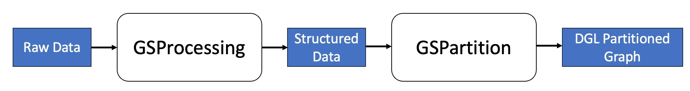

==============================
Distributed Graph Construction
==============================

Beyond single-machine graph construction, distributed graph construction offers enhanced scalability
and efficiency. This process involves two main steps: GraphStorm Distributed Data Processing (GSProcessing)
and GraphStorm Distributed Data Partitioning (GSPartition). GSProcessing will preprocess the raw data into structured
datasets, and GSPartition will process these structured datasets to create multiple partitions in
`DGL format <https://docs.dgl.ai/en/latest/api/python/dgl.DGLGraph.html>`_.

Here is an overview of the workflow for distributed graph construction:

* **Prepare input data**: GraphStorm Distributed Construction accepts tabular files in parquet/CSV format.
* **Run GSProcessing**: Use GSProcessing to process the input data. This step prepares the data for partitioning including edge and node data, transformation details, and node id mappings.
* **Run GSPartition**: Use GSPartition to partition the processed data into graph files suitable for distributed training. 

The following sections provide guidance on doing distributed graph construction.
The first section details the execution environment setup for GSProcessing.
The second section offers examples on drafting a configuration file for a GSProcessing job.
The third section explains how to deploy your GSProcessing job with AWS infrastructure.
The fourth section includes how to do GSPartition with the GSProcessing output.
The final section shows an example to quickly start GSProcessing and GSPartition.

.. toctree::
   :maxdepth: 1
   :glob:

   prerequisites/index.rst
   input-configuration.rst
   aws-infra/index.rst
   gspartition/index.rst
   example.rst