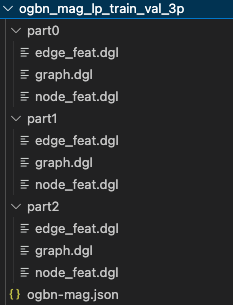

.. _distributed-cluster:

Use GraphStorm in a Distributed Cluster
========================================
GraphStorm can handle the enterprise-level graphs in a distributed way within a cluster. To leverage this feature, there are four steps to follow:

- Create a cluster with instances each of which can run GraphStorm Docker container.
- Set up IP address configuration and check 2222 port status.
- Process and partition large graphs into DGL distributed format.
- Launch the training within one instance' container.

The first example of this guide uses the `OGB-MAG <https://ogb.stanford.edu/docs/nodeprop/#ogbn-mag>`_ as example data and demonstrate how to use GraphStorm to train an RGCN model (a built-in model) in a cluster with three EC2 instances. The OGB-MAG data is large enough to demonstrate the scalability of GraphStorm, and also small enough to finish this tutorial in one hour.

Create a GraphStorm Cluster
----------------------------

Setup of each instance in a cluster
.......................................
A GraphStorm cluster contains several GPU instances each of which can run GraphStorm Docker container. For each instance, please follow the :ref:`Environment Setup <setup>` description to setup GraphStorm Docker container environment. This tutorial uses three EC2 instances in the cluster.

Setup of a shared file system for the cluster
...............................................
A GraphStorm cluster requires a shared file system, such as NFS or EFS, mounted to each instance in the cluster, in which all GraphStorm containers in the cluster can share data files, and save model artifacts and prediction results.

`Here <https://github.com/dmlc/dgl/tree/master/examples/pytorch/graphsage/dist#step-0-setup-a-distributed-file-system>`_ is the instruction of setting up NFS for a cluster provided by DGL. As the steps of setting up an NFS might be different system by system, we suggest users to look for additional information about NFS setting. Here are some available sources: `NFS tutorial <https://www.digitalocean.com/community/tutorials/how-to-set-up-an-nfs-mount-on-ubuntu-22-04>`_ by DigitalOcean, `NFS document <https://ubuntu.com/server/docs/service-nfs>`_ for Ubuntu, `NFS guide <https://www.linode.com/docs/guides/using-an-nfs-server-on-ubuntu2004/>`_ by Linode, `NFS tutorial <https://www.tecmint.com/how-to-setup-nfs-server-in-linux/>`_ at Tecmint, and `NFS guide <https://www.howtoforge.com/how-to-install-nfs-server-and-client-on-ubuntu-22-04/>`_ by HowtoForge.

For an EC2 cluster, users can set up EFS. `Here <https://docs.aws.amazon.com/efs/latest/ug/gs-step-two-create-efs-resources.html>`_ is the instruction of creating EFS; `here <https://docs.aws.amazon.com/efs/latest/ug/installing-amazon-efs-utils.html>`_ is the instruction of installing an EFS client; `here <https://docs.aws.amazon.com/efs/latest/ug/efs-mount-helper.html>`_ provides the instructions of mounting the EFS filesystem.

After setting up a shared file system, we can keep all partitioned graph data in the network filesystem. Then mount the data folder to the ``/path_to_data/`` of each instances in the cluster so that GraphStorm container can access the partitioned graph easily.

Create GraphStorm container by mounting the NFS folder
.......................................................
In each instance, use the following command to start a GraphStorm Docker container and run it as a backend daemon.

.. code-block:: shell

    nvidia-docker run -v /path_to_data/:/data \
                      -v /dev/shm:/dev/shm \
                      --network=host \
                      -d --name test graphstorm:local

This command mount the ``/path_to_data/`` folder to the container's ``/data/`` folder by which GraphStorm codes can access graph data and save training and inference outcomes.

Setup IP address configuration and check port 2222 status
----------------------------------------------------------
Collect the IP list
......................
The GraphStorm Docker containers use SSH on port 2222 to communicate with each other. Users need to collect all IP addresses of the three instances and put them into a text file, e.g., ``/data/ip_list.txt``, which is like:

.. figure:: ../../../tutorial/distributed_ips.png
    :align: center

Put this file into any GraphStorm container's ``/data/`` folder.

Check port 2222
................

.. note:: The GraphStorm Docker container use port ``2222`` to SSH login to containers running on other machines. Please make sure the host instance does not use this port.

Users also need to make sure the port ``2222`` is open for SSH commands. In the container environment, users can check the connectivity with the command ``ssh <ip-in-the-cluster> -p 2222``. Please replacing the ``<ip-in-the-cluster>`` with the real IP address in the ``ip_list.txt`` file above, e.g., 

.. code-block:: bash

    ssh 172.38.12.143 -p 2222

Process and Partition a Graph
-------------------------------
Pick one instance and run the following command to connect to the GraphStorm Docker container.

.. code-block:: bash

    docker container exec -it test /bin/bash

And then download and process the OGBN-MAG data with the command below.

.. code-block:: bash

    python3 /graphstorm/tools/gen_mag_dataset.py --savepath /data/ogbn-mag-lp/ --edge_pct 0.2

Because we use three GraphStorm instances in the cluster for model training, here we split the MAG data into three partitions by specifying the **--num_parts** argument to ``3``.

.. code-block:: bash

    python3 /graphstorm/tools/partition_graph_lp.py --dataset ogbn-mag \
                                                    --filepath /data/ogbn-mag-lp/ \
                                                    --num_parts 3 \
                                                    --balance_train \
                                                    --balance_edges \
                                                    --num_trainers_per_machine 4 \
                                                    --target_etypes author,writes,paper \
                                                    --output /data/ogbn_mag_lp_3p

After running commands in the previous step successfully, the partitioned OGBN-MAG graph has been stored in the ``/data/ogbn_mag_lp_3p`` folder whose structure is like the diagram below. Because the ``/data/`` folder is actually a shared filesystem, all instances in the cluster can access these files.

Launch Training in One Container
---------------------------------
When all three previous steps are done, it is easy to launch a distributed training job. Pick a GraphStorm container, e.g. the container with IP address 172.37.11.221, and run the following command. 

.. code-block:: bash

    python3 -m graphstorm.run.gs_link_prediction \
               --workspace /data/ogbn-mag-lp/ \
               --num_trainers 4 \
               --num_servers 1 \
               --num_samplers 0 \
               --part_config /data/ogbn_mag_lp_3p/ogbn-mag.json \
               --ip_config /data/ip_list.txt \
               --ssh_port 2222 \
               --cf /graphstorm/training_scripts/gsgnn_lp/mag_lp.yaml \
               --feat-name paper:feat \
               --save-model-path /data/ogbn-mag-lp/models/

That's it!

Train a Large Graph (OGBN-Papers100M)
--------------------------------------
The previous sections demonstrate GraphStorm's distributed training feature for a quick start. This section will use GraphStorm to train a large Graph data, i.e., `OGBN-Papers100M <https://ogb.stanford.edu/docs/nodeprop/#ogbn-papers100M>`_,  that can hardly be processed and trained in a single machine. The steps of training a large Graph is nearly the same as the above section, but need a few additional operations.

Create a GraphStorm Cluster
............................
In addition to the three GraphStorm instance created in the OGBN-MAG, to download and partition the OGBN-Papers100M graph, we need a new instance that have large memory, e.g., \>800GB. In this guide we use an AWS r6a.32xlarge instance, which has 1TB memory. For the instance, please follow the :ref:`Environment Setup <setup>` description to setup GraphStorm Docker container environment. Once building the GraphStorm Docker image in this instance, use the following command to start a GraphStorm Docker container.

.. code-block:: bash

    docker run -v /path_to_data/:/data \
                  -v /dev/shm:/dev/shm \
                  --network=host \
                  -d --name test graphstorm:local

.. note::
    - Use the "docker", instead of "nvidia-docker" command to create the GraphStorm container because the new r6a.32xlarge instance does not have GPUs configured.
    - Make sure there is at least 300GB free space in the /path_to_data/ folder.

Process and Partition a Graph
..............................
Connect to the GraphStorm Docker container with the below command.

.. code-block:: bash

    python3 /graphstorm/tools/partition_graph_lp.py --dataset ogbn-papers100M \
                                                    --num_parts 3 \
                                                    --balance_train \
                                                    --balance_edges \
                                                    --output /data/ogbn_papers100M_3p \
                                                    --train_pct 0.1 \
                                                    --filepath /data

Given the size of OGBN-Papers100M, the download and partition process could take more than 5 hours and consume around 700GB memory in peak. After the command finishes, the partitioned OGBN-Papers100M graphs are stored in the ``/data/ogbn_papers100M_3p`` folder whose structure is same as the OGBN-MAG's. 

Distribute Partitioned Graphs and Configurations to all Instances
...................................................................
In this step, users need to copy these partitioned files to the shared file system of the GraphStorm cluster. And the IP list collection and 2222 port open operations are identical to the above OGBN-MAG tutorial.

For the OGBN-Papers100M data, we use a YAML file, called ogbn_papers100M_nc_p3.yaml, that have the contents below.

.. code-block:: yaml

    ---
    version: 1.0
    gsf:
    basic:
        model_encoder_type: rgcn
        graph_name: ogbn-papers100M
        backend: gloo
        ip_config: /data/ip_list.txt
        part_config: /data/ogbn_papers100M_3p/ogbn-papers100M.json
        verbose: false
        no_validation: false
        evaluation_frequency: 500
    gnn:
        num_layers: 3
        hidden_size: 128
        mini_batch_infer: true
    input:
        restore_model_path: null
    output:
        save_model_path: null
        save_embed_path: null
    hyperparam:
        dropout: 0.
        lr: 0.001
        num_epochs: 4
        fanout: "5,10,15"
        eval_fanout: "5,10,15"
        batch_size: 128
        eval_batch_size: 128
        wd_l2norm: 0
    rgcn:
        num_bases: -1
        use_self_loop: true
        lp_decoder_type: dot_product
        sparse_optimizer-lr: 1e-2
        use_node_embeddings: false
    node_classification:
        target_ntype: "node"
        label_field: "labels"
        num_classes: 172

Launch Training in One Container
.................................
Launch the training for the OGBN-Papers100M is similar as the OGBN-MAG data. Pick a GraphStorm container, e.g. the container with IP address 172.37.11.221, and run the following command.

.. code-block:: bash

    python3 -m graphstorm.run.gs_node_classification \
            --workspace /data/ \
            --num_trainers 4 \
            --num_servers 1 \
            --num_samplers 0 \
            --part_config /data/ogbn_papers100M_3p/ogbn-papers100M.json \
            --ip_config /data/ip_list.txt \
            --ssh_port 2222 \
            --graph_format csc,coo \
            --cf /data/ogbn_papers100M_nc_p3.yaml \
            --feat-name feat

Due to the large size of Papers100M graph, it take around six minutes for all GraphStorm containers in the cluster to start their training processes and load corresponding partitions before the training starts.

Given a cluster with three AWS g4dn.12xlarge instances, each of which has 48 Intel Xeon vCPUs, four Nvidia T4 GPUs, and 192GB memory, it takes around 45 minutes to train one epoch with the given configurations.
