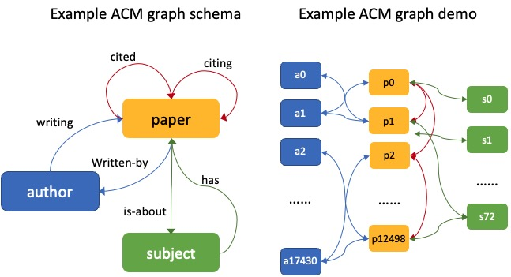
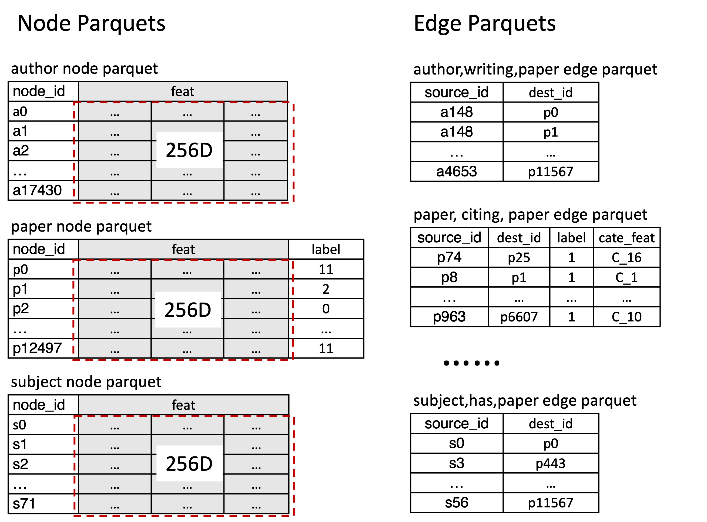
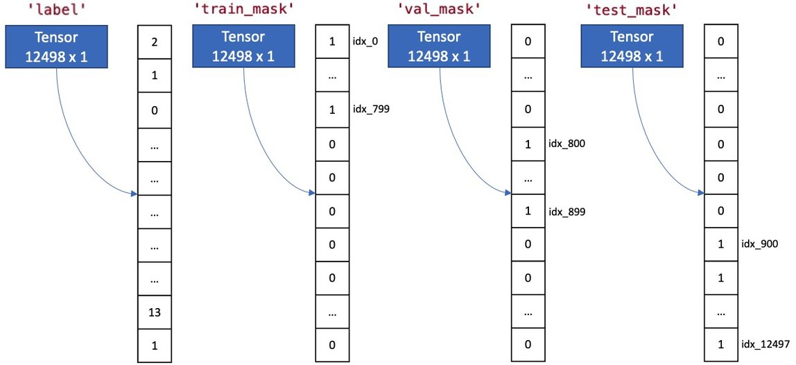

.. _use-own-data:

Use Your Own Data
==================
It is easy for users to prepare their own graph data and leverage GraphStorm's built-in GNN models, e.g., RGCN, RGAT and HGT, to perform GML tasks. It takes three steps to use your own graph data in GraphStorm:

* Step 1: Prepare your own graph data in the required format.
* Step 2: Modify the GraphStorm configuration YAML file.
* Step 3: Launch GraphStorm commands for training/inference.

Step 1: Prepare Your Own Graph Data
-------------------------------------
There are two options to prepare your own graph data for using GraphStorm:

- Option 1: prepare your graph in the raw table data format that GraphStorm' construction tools required, and use these construction tools to automatically generate the input files. **This is the preferred method**, as GraphStorm provides :ref:`distributed data processing and construciton tools<gs-processing>` to handle extreme large graph data.
- Option 2: prepare your data as a DGL heterogeneous graph following the specific format described below, and then use GraphStorm's partition tools to generate the input files. This option is for experienced DGL users and relatively small graph data.

.. _option-1:

Option 1: Required raw data format
.......................................
GraphStorm provides a set of graph construction tools to generate input files for using the training/inference commands. To use these tools, users would need to prepare their graph data into the raw data format required.

In general, the graph construction tool needs three sets of files as inputs. The detailed information about the raw data format can be found in the :ref:`Graph Construction Configurations<configurations-gconstruction>`.

* A configuration JSON file (**required**). It describes the graph structure, i.e. nodes and edges information, the tasks to perform, the node features, label information, and raw data file paths.
* A set of raw node data files (**optional**). Each type of nodes must have at least one file associated. If the file is too big, users can split this one file into multiple files that have the same columns and different rows.
* A set of raw edge data files (**required**). Each type of edges must have at least  one file associated. If the file is too big, users can split this one file into multiple files that have the same columns and different rows.

This tutorial uses the `ACM publication graph <https://data.dgl.ai/dataset/ACM.mat>`_ as a demonstration to show how to prepare users' own graph data, and what these files and their contents are like.

.. note:: The following commands assume users have installed GraphStorm and cloned the GraphStorm source code in the ``/graphstorm/`` folder.

First go the ``/graphstorm/examples/`` folder.

.. code-block:: bash

    cd /graphstorm/examples

Then run the command to create the ACM data with the required raw format.

.. code-block:: bash

    python3 /graphstorm/examples/acm_data.py --output-path /tmp/acm_raw

Once succeeded, the command will create the three sets of files under the ``/tmp/acm_raw/`` folder, as shown below. The next sections will explain each of them in details.

.. _acm-raw-data-output:

.. code-block:: bash

    /tmp/acm_raw
    config.json
    |- edges
        author_writing_paper.parquet
        paper_cited_paper.parquet
        paper_citing_paper.parquet
        paper_is-about_subject.parquet
        paper_written-by_author.parquet
        subject_has_paper.parquet
    |- nodes
        author.parquet
        paper.parquet
        subject.parquet

.. _input-config:

The input configuration JSON
```````````````````````````````
The above command automatically creates the examplary ACM `config.json` file, some of which are listed below.

.. code-block:: yaml

    {
        "version": "gconstruct-v0.1",
        "nodes": [

            ......

            {
                "node_type": "paper",
                "format": {
                    "name": "parquet"
                },
                "files": [
                    "/tmp/acm_raw/nodes/paper.parquet"
                ],
                "node_id_col": "node_id",
                "features": [
                    {
                        "feature_col": "feat",
                        "feature_name": "feat"
                    }
                ],
                "labels": [
                    {
                        "label_col": "label",
                        "task_type": "classification",
                        "split_pct": [
                            0.8,
                            0.1,
                            0.1
                        ]
                    }
                ]
            },

            ......

        ],
        "edges": [

            ......

            {
                "relation": [
                    "paper",
                    "citing",
                    "paper"
                ],
                "format": {
                    "name": "parquet"
                },
                "files": [
                    "/tmp/acm_raw/edges/paper_citing_paper.parquet"
                ],
                "source_id_col": "source_id",
                "dest_id_col": "dest_id",
                "labels": [
                    {
                        "task_type": "link_prediction",
                        "split_pct": [
                            0.8,
                            0.1,
                            0.1
                        ]
                    }
                ]
            },

        ......

        ]
    }

Based on the original ACM dataset, this example builds a simple heterogenous graph that contains three types of nodes and six types of edges as shown in the diagram below.



The examplary ACM graph also predifines two sets of labels. One set of labels are associated to the ``paper`` type nodes for a node classification demonstration, and another set is associated to the ``paper,citing,paper`` type edges for a link prediction demonstration. The above JSON contents specify how to split these labels, i.e., asking GraphStorm graph construction tools to randomly split labels into three groups, and 80% for training, 10% for validation, and the rest 10% for testing.

Customized label split
`````````````````````````
If users want to split labels with your own logics, e.g., time sequence, you can split labels first, and then provide the split information in the configuration JSON file or parquet file like the example below.
When using parquet files as input, please specify the column object you want to use for your labels. The column object here can be either a string or a list with a single string. When using parquet input, it allows input be either string or list of strings and it allows wildcard as the input.

JSON:

.. code-block:: json

    "labels": [
        {
            "label_col": "label",
            "task_type": "classification",
            "custom_split_filenames": {"train": "/tmp/acm_raw/nodes/train_idx.json",
                                       "valid": "/tmp/acm_raw/nodes/val_idx.json",
                                       "test": "/tmp/acm_raw/nodes/test_idx.json"}
        }
    ]

Parquet:

.. code-block:: json

    "labels": [
        {
            "label_col": "label",
            "task_type": "classification",
            "custom_split_filenames": {"train": "/tmp/acm_raw/nodes/train_idx.parquet",
                                       "valid": ["/tmp/acm_raw/nodes/val_idx_1.parquet", "/tmp/acm_raw/nodes/val_idx_2.parquet"],
                                       "test": "/tmp/acm_raw/nodes/test_idx_*.parquet"
                                        "column": "ID"}
        }
    ]

Instead of using the ``split_pct``, users can specify the ``custom_split_filenames`` configuration with a value, which is a dictionary, to use custom data split. The dictionary's keys could include ``train``, ``valid``, and ``test``, and values of the dictionary are JSON files that contains node IDs in each set.

These JSON files only need to list the IDs on its own set. For example, in a node classification task, there are 100 nodes and node ID starts from 0, and assume the last 50 nodes (ID from 49 to 99) have labels associated. For some business logic, users want to have the first 10 of the 50 labeled nodes as training set, the last 30 as the test set, and the middle 10 as the validation set. Then the `train_idx.json` file should contain the integer from 50 to 59, and one integer per line. Similarly, the `val_idx.json` file should contain the integer from 60 to 69, and the `test_idx.json` file should contain the integer from 70 to 99. Contents of the `train_idx.json` file are like the followings.

.. code-block:: yaml

    50
    51
    52
    ...
    59

For edge data, users can do the similar thing as defining customized node labels to define the customized edge labels. The configuration looks same for JSON files, for parquet files, users need to specify both the source id column and destination id column in a list of strings:

JSON:

.. code-block:: json

    "labels": [
        {
            "label_col": "label",
            "task_type": "classification",
            "custom_split_filenames": {"train": "/tmp/acm_raw/edges/train_idx.json",
                                       "valid": "/tmp/acm_raw/edges/val_idx.json",
                                       "test": "/tmp/acm_raw/edges/test_idx.json"}
        }
    ]

Parquet:

.. code-block:: json

    "labels": [
        {
            "label_col": "label",
            "task_type": "classification",
            "custom_split_filenames": {"train": "/tmp/acm_raw/edges/train_idx.parquet",
                                       "valid": "/tmp/acm_raw/edges/val_idx.parquet",
                                       "test": "/tmp/acm_raw/edges/test_idx.parquet",
                                       "column":  ["src", "dst"]}
        }
    ]

The values of dictionary files should be json as well here. Each line of the json file should an array with the source node and destination node. For example, contents of `train_idx.json` should look like the following:

.. code-block:: yaml

    ["p0", "p1301"]
    ["p0", "p9830"]
    ["p1", "p1910"]
    ["p1", "p2165"]
    ["p1", "p6894"]
    ["p12497", "p12498"]

.. _raw-data-files:

Input raw node/edge data files
```````````````````````````````
The raw node and edge data files are both in a parquet format, whose contents are demonstrated as the diagram below.



In this example, only the ``paper`` nodes have labels and the task is node classification. So, in the JSON file, the ``paper`` node has the ``labels`` field, and the ``task_type`` is specified as ``classification``. Correspondingly, in the paper node parquet file, there is a column, ``label``, stores the label values. All edge types do not have features associated. Therefore, we only have two columns in these parquet files for edges, the ``source_id`` and the ``dest_id``. For the link prediction task, there is no actual labels. Users just need to specify the ``labels`` field in one or more ``edge`` objects of the JSON config file.


.. _run-graph-construction:

Run graph construction
```````````````````````
The configuration JSON file along with these node and edge parquet files are the required inputs of the GraphStorm's construction tools. Then we can use the tool to create the partition graph data with the following command.

.. code-block:: bash

    python -m graphstorm.gconstruct.construct_graph \
              --conf-file /tmp/acm_raw/config.json \
              --output-dir /tmp/acm_gs \
              --num-parts 1 \
              --graph-name acm

.. _output-graph-construction:

Outputs of graph construction
```````````````````````````````
The above command reads in the JSON file, and matchs its contents with the node and edge parquet files. It will then read all parquet files, construct the graph, check file correctness, pre-process features, and eventually split the graph into partitions. Outputs of the command will be saved under the ``/tmp/acm_gs/`` folder as followings:

.. code-block:: bash

    /tmp/acm_gs
    acm.json
    edge_label_stats.json
    edge_mapping.pt
    node_label_stats.json
    node_mapping.pt
    |- part0
        edge_feat.dgl
        graph.dgl
        node_feat.dgl
    |- raw_id_mappings
        |- author
            part-00000.parquet
        |- paper
            part-00000.parquet
        |- subject
            part-00000.parquet

Because the above command specifies the ``--num-parts`` to be ``1``, there is only one partition created, which is saved in the ``part0`` folder. These files become the inputs of GraphStorm's launch scripts.

.. note::

    - Because the parquet format has some limitations, such as only supporting 2 billion elements in a column, etc, we suggest users to use HDF5 format for very large datasets.
    - The mapping files, ``node_mapping.pt``, ``edge_mapping.pt`` and the files under ``raw_id_mappings``, are used to record the mapping between the original node and edge ids in the raw data files and the ids of nodes and edges in the Graph Node ID space. They are important for mapping the training and inference outputs back to the Raw Node ID space in the original input data. Therefore, **DO NOT** move or delete them.

.. _option-2:

Option 2: Required DGL graph
................................
For some users who are already familiar with `DGL <https://www.dgl.ai/>`_, they can convert their graph data into the required DGL graph format. And then use GraphStorm's partition tools to create the inputs of GraphStorm's launch scripts.

Required DGL graph format
```````````````````````````
- a `dgl.heterograph <https://docs.dgl.ai/generated/dgl.heterograph.html#dgl.heterograph>`_.
- All nodes/edges features are set in nodes/edges' data field, and remember the feature names, which will be used in the later steps.
    - For nodes' features, the common way to set features is like ``g.nodes['nodetypename'].data['featurename']=nodefeaturetensor``, The formal explanation of DGL's node feature could be found in the `Using node features <https://docs.dgl.ai/generated/dgl.DGLGraph.nodes.html>`_. Please make sure every node feature is a 2D tensor.
    - For edges' features, the common way to set features is like ``g.edges['edgetypename'].data['featurename']=edgefeaturetensor``, The formal explanation of DGL's edge feature could be found in the `Using edge features <https://docs.dgl.ai/generated/dgl.DGLGraph.edges.html>`_. Please make sure every edge feature is a 2D tensor.
- Save labels (for node/edge tasks) into the target nodes/edges as a feature, and remember the label feature names, which will be used in the later steps.
    - The common way to set node-related labels as a feature is like ``g.nodes['predictnodetypename'].data['labelname']=nodelabeltensor``.
    - The common way to set edge-related labels as a feature is like ``g.nodes['predictedgetypename'].data['labelname']=edgelabeltensor``.
    - For link prediction task, a common way to extract labels is to use existing edges as the positive edges and use negative sampling method to extract non-exist edges as negative edges. So in this step, we do not need to set the labels. The GraphStorm has implemented this function.
- (Optional) if you have your own train/validation/test split on nodes/edges, you can put the train/validation/test nodes/edges index tensors as three nodes/edges features with the feature names as ``train_mask``, ``val_mask``, and ``test_mask``. If you do not have nodes/edges split, you can use the split functions provided in the GraphStorm partition tools to create them in the next step.
    - For training nodes, the setting is like ``g.nodes['predictnodetypename'].data['train_mask']=trainingnodeindexetensor``.
    - For validation nodes, the setting is like ``g.nodes['predictnodetypename'].data['val_mask']=validationnodeindexetensor``. Make sure you use 'val_mask' as the feature name because the GSF uses this name by default.
    - For validation nodes, the setting is like ``g.nodes['predictnodetypename'].data['test_mask']=testnodeindexetensor``.
    - Similar to nodes splits, you can use the same feature names, ``train_mask``, ``val_mask``, and ``test_mask``, to assign the edge index tensors.
    - The index tensor is either a boolean tensor, or an integer tensor including only 0s and 1s.

Once this DGL graph is constructed, you can use DGL's `save_graphs() <https://docs.dgl.ai/generated/dgl.save_graphs.html?highlight=save_graphs#dgl.save_graphs>`_ function to save it into a local file. The file name must follow GraphStorm convention: ``<datasetname>.dgl``. You can give your graph dataset a name, e.g., ``acm`` or ``ogbn_mag``.

The ACM graph data example
`````````````````````````````
For the ACM data, the following command can create a DGL graph as the input for GraphStorm's partition tools.

.. code-block:: bash

    python3 /graphstorm/examples/acm_data.py \
            --output-type dgl \
            --output-path /tmp/acm_dgl

The below image show how the built DGL ACM data looks like.

.. figure:: ../../../tutorial/ACM_graph_schema.png
    :align: center



.. note::

    - Because the Option 2 method will not be supported after the 0.2 version, some new graph construction features, such as label statistics generation and node ID mapping, are not available in this option. To use the latest construction features, please refer to the :ref:`Option 1 <option-1>`.

Partition the DGL ACM graph
```````````````````````````
GraphStorm provides two graph partition tools, the `partition_graph.py <https://github.com/awslabs/graphstorm/blob/main/tools/partition_graph.py>`_ for node/edge prediction graph partition, and the `partition_graph_lp.py <https://github.com/awslabs/graphstorm/blob/main/tools/partition_graph_lp.py>`_ for the link prediction graph partition.

The below command partition the DGL ACM graph, the ``acm.dgl`` in the ``/tmp/acm_dgl`` folder, into one partition, and save the partitioned data to ``/tmp/acm_nc/`` folder for node classification task.

.. code-block:: bash

    python /graphstorm/tools/partition_graph.py \
           --dataset acm \
           --filepath /tmp/acm_dgl \
           --num-parts 1 \
           --target-ntype paper \
           --nlabel-field paper:label \
           --output /tmp/acm_nc

Outputs of the command are under the ``/tmp/acm_nc/`` folder with the similar contents as the :ref:`Option 1 <option-1>`.

In terms of link prediction task, run the following command to partition the data and save to the ``/tmp/acm_lp/`` folder.

.. code-block:: bash

    python /graphstorm/tools/partition_graph_lp.py \
           --dataset acm \
           --filepath /tmp/acm_dgl \
           --num-parts 1 \
           --target-etype paper,citing,paper \
           --output /tmp/acm_lp

Please refer to :ref:`Graph Partition for DGL Graphs <configurations-partition>` guideline for more details of the arguments of the two partition tools.

Step 2: Modify the YAML configuration file to include your own data's information
-----------------------------------------------------------------------------------
It is common that users will copy and reuse GraphStorm's built-in scripts and yaml files to run training/inference on their own graph data, but forget to change the contents of yaml files to match their own data. Below are some parameters that users need to double check and make changes accordingly.

- **node_feat_name**: if some types of nodes have features, please make sure to specify these feature names in either the YAML file or use an argument in the launch command. Otherwise, GraphStorm will ignore any features the nodes might have, hence only using learnable embeddings as their features.

For **`Classification/Regression`** tasks:

- **label_field**: please change values of this field to specify the field name of labeled data in your graph data.
- **num_classes**: please change values of this filed to specify the number of classes to be predicted in your graph data if doing a `Classification`` task.

For **`Node Classification/Regression`** tasks:

- **target_ntype**: please change values of this field to the node type that the label is associated, which should be the same node type for prediction.

For **`Edge Classification/Regression`** tasks:

- **target_etype**: please change values of this field to the edge type that the label is associated, which should be the same edge type for prediction.

For **`Link Prediction`** tasks:

- **train_etype**: please specify values of this field for the edge type that you want to do link prediction for the downstream task, e.g. recommendation or search. Although if not specified, i.e. put ``None`` as the value, all edge types will be used for training, this might not commonly used in practice for most `Link Prediction` related tasks.
- **eval_etype**: it is highly recommended that you set this value to be the same as the value of ``train_etype``, so that the evaluation metric can truly demonstrate the performance of models.

Besides these parameters, it is also important for you to use the correct format to configure node/edge types in the YAML files. For example, in an edge-related task, you should provide a canonical edge type, e.g. **author,write,paper** (no white spaces in this string), for edge types, rather than the edge name only, e.g. the **write** only.

For more detailed information of these parameters, please refer to the :ref:`GraphStorm Training and Inference Configurations <configurations-run>` page.

Example ACM  YAML files
.......................

Below is an example YAML configuration file for the ACM data, which sets to use GraphStorm's built-in RGCN model for node classification on the ``paper`` nodes. The YAML file can also be found at the `/graphstorm/examples/use_your_own_data/acm_nc.yaml <https://github.com/awslabs/graphstorm/blob/main/examples/use_your_own_data/acm_nc.yaml>`_.

.. code-block:: yaml

    ---
    version: 1.0
    gsf:
    basic:
        model_encoder_type: rgcn
        backend: gloo
        verbose: false
    gnn:
        fanout: "50,50"
        num_layers: 2
        hidden_size: 256
        use_mini_batch_infer: false
    input:
        restore_model_path: null
    output:
        save_model_path: /tmp/acm_nc/models
        save_embeds_path: /tmp/acm_nc/embeds
    hyperparam:
        dropout: 0.
        lr: 0.0001
        lm_tune_lr: 0.0001
        num_epochs: 200
        batch_size: 1024
        wd_l2norm: 0
        alpha_l2norm: 0.
    rgcn:
        num_bases: -1
        use_self_loop: true
        sparse_optimizer_lr: 1e-2
        use_node_embeddings: false
    node_classification:
        target_ntype: "paper"
        label_field: "label"
        multilabel: false
        num_classes: 14

For the link prediction task, the examplary YAML file can be found at the `/graphstorm/examples/use_your_own_data/acm_lp.yaml <https://github.com/awslabs/graphstorm/blob/main/examples/use_your_own_data/acm_lp.yaml>`_.

Users can copy these YAML files to the ``/tmp`` folder within the GraphStorm container for the next step.

.. _launch_training_oyog:

Step 3: Launch training and inference scripts on your own graphs
-----------------------------------------------------------------

With the partitioned data and configuration YAML file available, it is easy to use GraphStorm's training and infernece scripts to launch the job.

Below is a launch script example that trains a GraphStorm built-in RGCN model on the ACM data for node classification.

.. code-block:: bash

    python -m graphstorm.run.gs_node_classification \
              --workspace /tmp \
              --part-config /tmp/acm_gs/acm.json \
              --num-trainers 1 \
              --num-servers 1 \
              --cf /tmp/acm_nc.yaml \
              --save-model-path /tmp/acm_nc/models \
              --node-feat-name paper:feat author:feat subject:feat

Link prediction training can be performed using the following command.

.. code-block:: bash

    python -m graphstorm.run.gs_link_prediction \
              --workspace /tmp \
              --part-config /tmp/acm_gs/acm.json \
              --num-trainers 1 \
              --num-servers 1 \
              --cf /tmp/acm_lp.yaml \
              --save-model-path /tmp/acm_lp/models \
              --node-feat-name paper:feat author:feat subject:feat

Similar to the :ref:`Quick-Start <quick-start-standalone>` tutorial, users can launch the inference script on their own data. Below is the customized scripts for inference in the ACM graph.

.. code-block:: bash

    # Node Classification
    python -m graphstorm.run.gs_node_classification \
              --inference \
              --workspace /tmp \
              --part-config /tmp/acm_gs/acm.json \
              --num-trainers 1 \
              --num-servers 1 \
              --cf /tmp/acm_nc.yaml \
              --node-feat-name paper:feat author:feat subject:feat \
              --restore-model-path /tmp/acm_nc/models/epoch-0 \
              --save-prediction-path  /tmp/acm_nc/predictions

    # Link Prediction
    python -m graphstorm.run.gs_link_prediction \
              --inference \
              --workspace /tmp \
              --part-config /tmp/acm_gs/acm.json \
              --num-trainers 1 \
              --num-servers 1 \
              --cf /tmp/acm_lp.yaml \
              --save-model-path /tmp/acm_lp/models \
              --node-feat-name paper:feat author:feat subject:feat \
              --restore-model-path /tmp/acm_lp/models/epoch-0 \
              --save-embed-path  /tmp/acm_lp/embeds

Once users get familiar with the three steps of using your own graph data, the next step would be look through :ref:`GraphStorm's Configurations<configurations>` that control the three steps for your specific requirements.
