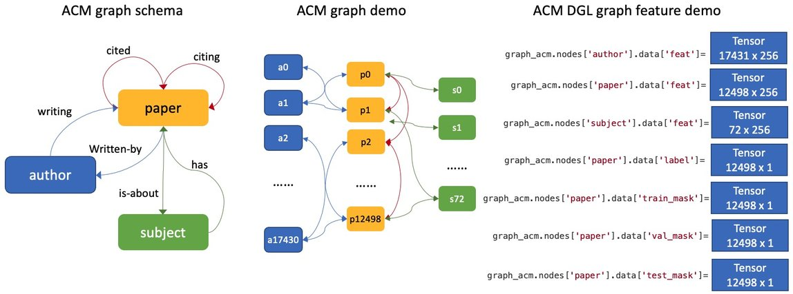

.. _use-own-data:

Use Your Own Data Tutorial
============================
It is easy for users to prepare their own graphs data and leverage GraphStorm’s built-in GNN models, e.g., RGCN and RGAT, to perform graph machine learning tasks with the three steps:

- 1. Prepare graph data for GraphStorm.
- 2. Customerize the configuration file.
- 3. Launch training and inference scripts.

Prepare Graph Data for GraphStorm
-----------------------------------
There are two ways to prepare users' own data as input of GraphStorm's training and inference scripts:

- Prepare raw data files and use GraphStorm's graph construction tool to build the input files.
- Prepare a DGL graph and use GraphStorm's partition tool to build the input files.

Prepare raw data files
````````````````````````
GraphStorm has a `graph construction tool <https://github.com/awslabs/graphstorm/blob/main/python/graphstorm/gconstruct>`_. Users can follow this `README <https://github.com/awslabs/graphstorm/blob/main/python/graphstorm/gconstruct/README.md>`_ to prepare their graph data.

Prepare a DGL graph
````````````````````
For users who are already familiar with `DGL <https://www.dgl.ai/>`_, GraphStorm provides an example that build a DGL heterogeneous graph from the raw ACM publication graph. The following commands download the raw ACM data, build a DGL graph and then partition it into one partition that can be used by GraphStorm.

.. code-block:: bash

    python3 /graphstorm/examples/acm_data.py --output-path /data/acm_nc
    
    python3 /graphstorm/tools/partition_graph.py \
            --dataset /data/acm_nc \
            --filepath /data/acm_nc \
            --num_parts 1 \
            --predict_ntype paper \
            --nlabel_field paper:label \
            --generate_new_node_split true \
            --output /data/acm_nc

The commands will create a file, named ``acm.json`` and a ``part0`` subfolder under the ``/data/acm_nc`` folder. The acm graph has a 256d random value to each node for all node types, and split the labels on the **paper** into training, validation,  and testing sets. More details of this data can be found in the :ref:`ACM Graph Details <ACM_details>`.

Customerize the Configuration File
----------------------------------
It is common that users will copy and reuse GraphStorm's built-in scripts and yaml files to run on their own graph data, but forget to change the contents of yaml files to match their own data. Below are some configurations that users need to double check and make changes accordingly.

- **part_config**: please change value of this configure to where you store the partitioned graph's JSON file. It is better to use an absolute path to avoid path mis-match.
- **ip_config**: please make sure ip_list.txt created and the path of the ip_list.txt file is correct.

If you conduct Classification/Regression tasks,

- **label_field**: please change value of this field to fit to the field name of labeled data in your graph data.
- **num_classes**: please change value of this filed to fit to the number of classes to be predicted in your graph data if doing a Classification task.

If you conduct Node Classification/Regression tasks,

- **predict_ntype**: please change value of this field to the node type that the label is associated, which should be the same node type for prediction.

If you conduct Edge Classification/Regression tasks,

- **target_etype**: please change value of this field to the edge type that the label is associated, which should be the same edge type for prediction.

If you conduct Link Prediction tasks,

- **train_etype**: please specify value of this field for the edge type that you want to do link prediction for the downstream task, e.g. recommendation or search. Although if not specified, i.e. put None as the value, all edge types will be used for training, this might not commonly used practice for most Link Prediction related tasks.
- **eval_etype**: it is highly recommended that set this value to be the same as the value of train_etype, so that the evaluation metric can truly demonstrate the performance of models.

Besides these configuration, it is also important for you to use the correct format to configure node/edge types in the yaml files. For example, in an edge-related task, you should provide a canonical edge type, e.g. "**user,write,paper**" (no white spaces in this string), for edge types, rather than the edge name only, e.g. the "**write**". 

For more detailed information of these options, please refer to the :ref:`GraphStorm Configuration <configurations>` page.

Launch Training/Inference
--------------------------

When the graph and configuration files are ready, users can launch a traing job with the similar scripts. Below is the customized scripts for training node classification on the ACM graph.

.. code-block:: bash

    touch /data/ip_list.txt
    echo 127.0.0.1 > /data/ip_list.txt

    python3 ~/dgl/tools/launch.py \
            --workspace /graphstorm/examples/use_your_own_data \
            --part_config /data/acm_nc/acm.json \
            --ip_config /data/ip_list.txt \
            --num_trainers 1 \
            --num_servers 1 \
            --num_samplers 0 \
            --ssh_port 2222 \
            "python3 /graphstorm/training_scripts/gsgnn_np/gsgnn_np.py \
                    --cf /graphstorm/examples/use_your_own_data/acm_nc.yaml \
                    --ip-config /data/ip_list.txt \
                    --feat-name paper:feat author:feat subject:feat \
                    --save-model-path /data/acm_nc/models"

Similar to the Quick-Start tutorial, users can launch the inference script on thier own data. Below is the customized scripts for predicting the classes of nodes in the test set of the ACM graph.

.. code-block:: bash

    python3 ~/dgl/tools/launch.py \
            --workspace /graphstorm/examples/use_your_own_data \
            --part_config /data/acm_nc/acm.json \
            --ip_config /data/ip_list.txt \
            --num_trainers 1 \
            --num_servers 1 \
            --num_samplers 0 \
            --ssh_port 2222 \
            "python3 /graphstorm/inference_scripts/np_infer/np_infer_gnn.py \
                    --cf /graphstorm/examples/use_your_own_data/acm_nc.yaml \
                    --ip-config /data/ip_list.txt \
                    --feat-name paper:feat author:feat subject:feat \
                    --restore-model-path /data/acm_nc/models/epoch-0 \
                    --save_predict-path  /data/acm_nc/predictions"


.. _ACM_details:

ACM Graph Details
------------------

ACM DGL graph structure
`````````````````````````

The following diagrams demonstrate the graph data structure used in this tutorial.



.. figure:: ../../../tutorial/ACM_LabelAndMask.png
    :align: center

Example ACM node classification YAML file
```````````````````````````````````````````
Below is an example YAML configuration file, which sets to use GraphStorm’s built-in RGCN model for node classification on the “paper” type nodes. The YAML file can also be found at the `GraphStorm Example <https://github.com/awslabs/graphstorm/examples/use_your_own_data/>`_ folder.

.. code-block:: yaml

    ---
    version: 1.0
    gsf:
    basic:
        model_encoder_type: rgcn
        graph_name: acm
        backend: gloo
        num_gpus: 4
        ip_config: ip_list.txt
        part_config: /data/acm_nc/acm.json
        verbose: false
        no_validation: false
        alpha_l2norm: 0.
    gnn:
        fanout: "50,50"
        n_layers: 2
        n_hidden: 256
        mini_batch_infer: false
    input:
        restore_model_path: null
    output:
        save_model_path: /data/outputs
        save_embeds_path: /data/outputs
    hyperparam:
        dropout: 0.
        lr: 0.0001
        bert_tune_lr: 0.0001
        n_epochs: 200
        batch_size: 1024
        eval_batch_size: 1024
        bert_infer_bs: 128
        wd_l2norm: 0
    rgcn:
        n_bases: -1
        use_self_loop: true
        sparse_lr: 1e-2
        use_node_embeddings: false
    node_classification:
        predict_ntype: "paper"
        label_field: "label"
        multilabel: false
        num_classes: 14
