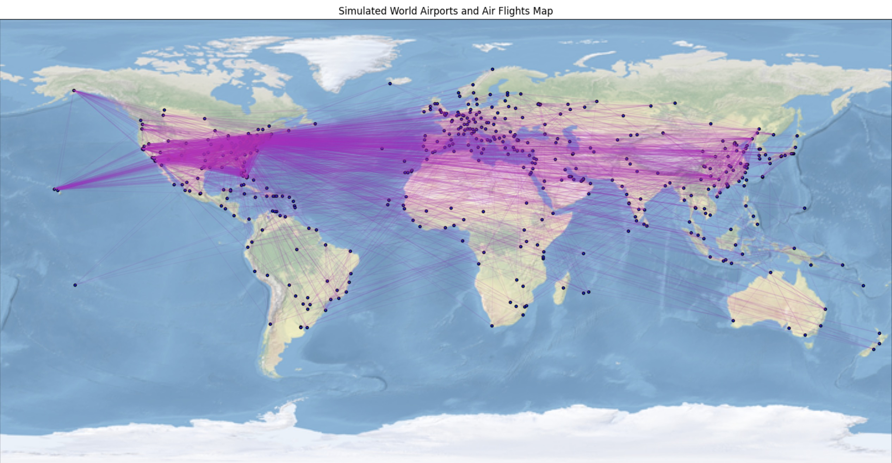

# An Example for Air Transportation Traffic Prediction using GraphStorm APIs
This GraphStorm example illustrates the utilization of the newly introduced feature in version 0.4, supporting edge features in GNN message-passing computation, to perform time series prediction on an air transportation network.

This example utilizes a synthetic dataset, which can be generated by executing the `Synthetic_Airport_Traffic_wAirlines.ipynb` notebook. The dataset simulates a global air transportation network featuring major international airports, along with fictional airlines and flight routes defined by predetermined capacities. The figure below illustrates the major airports and the simulated flight routes derived from this synthetic dataset.

Users can explore the Jupyter notebook to gain a deeper understanding of the underlying design concepts and the procedures used for data generation.

Once the raw synthetic data, consisting of three parquet files, is generated, users can utilize the `Air_Traffic_Data_Exp&Gc.ipynb` notebook to explore the dataset and construct the `config.json` file required for graph construction with GraphStorm. This notebook also executes the gconstruct command provided by GraphStorm to build a graph for GNN model training.

Using the synthetic dataset, this example addresses a node time series prediction task, specifically forecasting the accumulated inventory amount at airports. Users can experiment with the `AirTrafficPrediction.ipynb` notebook to execute the model training and inference pipeline. Since node time series prediction is not among the six tasks currently supported by GraphStorm, this example demonstrates the implementation of a custom GNN model that leverages a sliding-window strategy for time series prediction. For additional details, users are encouraged to review the contents of the `nr_models.py` Python file.
